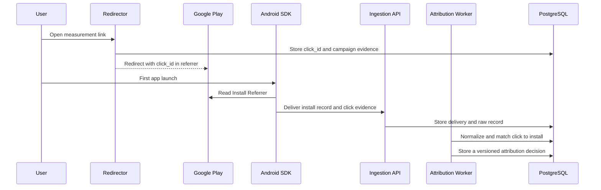

# Initial Architecture

## Approach

Start with a modular monolith and PostgreSQL. Do not add ClickHouse, Kafka, or service decomposition until measured load demonstrates the need.

Proposed stack:

- Server: TypeScript on Node.js
- Schemas: JSON Schema Draft 2020-12 with generated runtime types
- Database: PostgreSQL
- Android SDK: Kotlin
- Unity integration: C# API with Android Kotlin and iOS Swift/C ABI bridges
- iOS SDK: Swift Package with first-party, Apple, and provider-neutral MAX products
- Dashboard: dependency-free, server-rendered TypeScript HTML with no client JavaScript
- Local runtime: Docker Compose

## Reference deployment boundary

M1 through M4 use one portable deployment path: Docker Compose, Node.js services, and PostgreSQL. They do not adopt Cloudflare Queues, R2, or D1. M2 may offer a Cloudflare Workers redirector as an optional edge adapter, but the same redirector behavior must remain available through the portable Node.js interface. The ingestion API, worker, authoritative ledger, protected evidence, Apple postback receiver, and dashboard do not require Cloudflare. No public contract depends on a Cloudflare-specific API.

The decided M1 implementation baseline is documented in [M1 Design Baseline](design/m1-baseline.md). R-22 resolves every option set in that document to its recorded recommendation. The Android, Unity, redirector, and SDK-ingestion design is fixed by R-24 in [M2 Design Baseline](design/m2-baseline.md). The dependency-free server-rendered dashboard, tenant-scoped session, reader-role, and typed reporting design is fixed by R-25 in [M3 Design Baseline](design/m3-baseline.md). The Swift SDK, Apple receiver, AdServices, conversion schema, and aggregate-series design is fixed by R-28 in [M4 Design Baseline](design/m4-baseline.md).

## Android M2 flow



## Components

### M1a runtime component inventory

The following component identifiers are mechanically matched to the threat tables.

<!-- m1-component:import-worker -->
- `import-worker`: file-driven existing-MMP imports, cost adapters, MAX inbox processing, and contract evaluation.
<!-- m1-component:max-receiver -->
- `max-receiver`: authenticated, allowlisted, rate-limited public GET receiver that appends one durable inbox row before returning 204.
<!-- m1-component:payload-store -->
- `payload-store`: AES-256-GCM envelope-encrypted protected objects with one random data key and independently purgeable key entry per object.
<!-- m1-component:admin-api -->
- `admin-api`: scrypt-verified bearer authentication, two-key overlap, deletion requests, and append-only privileged-operation audit.
<!-- m1-component:postgres-ledger -->
- `postgres-ledger`: authoritative RLS, append-only raw evidence, deliveries, corrections, tombstones, decisions, costs, and metric runs.
<!-- m1-component:runtime-ci -->
- `runtime-ci`: Linux/PostgreSQL migration, unit/integration, golden parity, Compose smoke, threat coverage, and per-workspace SBOM gate.

### M2 component inventory

The following four identifiers are covered mechanically.

<!-- m1-component:redirector -->
- `redirector`: portable Node HTTP shell and shared deterministic core for stored measurement links, Play referrers, click evidence, safe fallback, and memory-only source-IP rate limiting.
<!-- m1-component:sdk-ingestion -->
- `sdk-ingestion`: app-key enrollment, per-installation credentials, HMAC request integrity, ephemeral nonce replay defence, durable batch inbox, ordered worker drain, and on-device deletion authorization.
<!-- m1-component:sdk-android -->
- `sdk-android`: Kotlin client boundary for Install Referrer, Meta evidence, durable delivery, consent, collection lifecycle, and MAX revenue mapping.
<!-- m1-component:unity-bridge -->
- `unity-bridge`: C# bridge to Kotlin/Swift for Unity lifecycle, main-thread callbacks, and Android/iOS MAX impression-revenue callbacks.

### M3 component inventory

<!-- m1-component:dashboard -->
- `dashboard`: tenant-scoped opaque sessions, strict credential separation, a read-only PostgreSQL role, shared typed report filters, aggregate exports, and dependency-free server-rendered HTML/SVG.

### M4 component inventory

<!-- m1-component:apple-postback-receiver -->
- `apple-postback-receiver`: API routes for SKAdNetwork and AdAttributionKit developer copies, Apple signature/JWS verification, non-enumerating app lookup, replay/conflict handling, and protected AdServices follow-up.
<!-- m1-component:sdk-ios -->
- `sdk-ios`: Swift first-party client with one excluded storage subtree, durable SQLite queue, HMAC delivery, consent/reset lifecycle, AdServices, conversion-value updates, MAX mapping, Unity C ABI, privacy manifest, symbol audit, and dependency-empty runtime SBOM.

### Redirector

- Accepts `GET /r/{slug}`
- Resolves an approved destination from the link configuration
- Generates and records a server-side `click_id`
- Adds an encoded referrer to the Google Play URL on Android
- Falls back to a safe configured destination without exposing internal errors

### Ingestion API

- Accepts `POST /v1/events/batch`
- Assigns the authoritative tenant and app from an authenticated SDK key or adapter configuration; client-supplied IDs are consistency checks only
- Validates payload size, event count, schema version, and client-clock skew: when client `occurred_at` is later than `received_at + 5 minutes`, retain it as evidence and mark `clock_skew_suspected`; it never controls an attribution window
- Stores delivery, raw record, and logical event as separate concepts
- Distinguishes successful receipt from successful normalization or attribution

Minimal delivery example:

```json
{
  "raw_record": {
    "contract_version": "0.2.0",
    "record_id": "record:example-install",
    "tenant_id": "tenant:example",
    "app_id": "app:example",
    "producer": "sdk-android",
    "producer_version": "0.2.0",
    "event_id": "event:example-install",
    "delivery_id": "delivery:example-install",
    "event_name": "install",
    "schema_version": "0.2.0",
    "payload_sha256": "ef404508d45f9dff0b61f7ed43c0ad8e06c9723440f23645db82233391575249",
    "occurred_at": "2026-08-11T00:00:00.000Z",
    "occurred_at_source": "device",
    "received_at": "2026-08-11T00:00:01.000Z",
    "payload_lifecycle_status": "available",
    "raw_payload_ref": "protected:example-install",
    "processing_purpose_id": "attribution",
    "consent_evaluation_policy_version": "consent-policy-0.2",
    "consent_decision_reason_code": "consent_not_required"
  },
  "payload": {
    "event_name": "install",
    "installation_id": "installation:example",
    "referrer_status": "none",
    "install_type": "first_install"
  }
}
```

The canonical schemas live in `schemas/`; this example is illustrative and validates against `schemas/raw-record.schema.json` and `schemas/events/install.schema.json`. The payload digest is SHA-256 over the RFC 8785 JCS UTF-8 serialization of the shown payload.

### Attribution Core

Implement attribution as a pure evaluator. Recalculation must fix the inputs and all relevant policy versions:

- Raw-record watermark
- Immutable input snapshot ID or ledger position
- Attribution rule bundle
- Metric definition
- Time zone and window boundaries
- FX policy and rounding
- Output schema version

Initial Android rule:

1. Extract a verifiable `click_id` from Install Referrer evidence.
2. Confirm that the click belongs to the same tenant and app.
3. Evaluate the seven-day half-open window with the redirector-recorded click time and the Google Play server `install_begin_at_server`; device `occurred_at` is evidence only and never decides the window.
4. Return `non_organic` with a deterministic method and reason when valid.
5. Otherwise return `organic` or `unattributed` with an explicit reason code.

### Reporting API

- `GET /v1/reports/metrics?app_id=...&format=json|csv` returns tenant-scoped, validated-app metric rows under one typed filter and keyset-pagination contract.
- `GET /v1/reports/records?app_id=...&watermark_at_most=...` returns aggregate counts and declared non-identifying dimensions only; it never returns an installation, click, record ID, payload, or payload reference.
- `GET /v1/audit/differences?app_id=...&format=json|csv` renders only persisted reconciliation artifacts, including internal/external snapshots, protected matching-key metadata, candidates, exclusions, windows, joins, freshness, and neutral reason codes.
- JSON and CSV are generated from one normalized row model. Metric rows carry the metric-definition version, policy versions, input watermark, immutable snapshot ID, freshness, and explicit present/undefined value state.
- Date filters are half-open, filter values are bound parameters, supersession defaults to the latest row, and `supersession=all` exposes history. Pagination uses an opaque keyset cursor and never `OFFSET`.
- Undefined ROAS has an absent numeric value and an explicit reason. It is not coerced to zero or infinity.
- Raw-record access remains separate from aggregate reporting; these endpoints never expose raw payloads.
- The authenticated scope fixes the tenant. The request supplies an `app_id` that is validated against that tenant's registered apps; unknown and cross-tenant apps have the same response. Responses use `cache-control: no-store`.
- Aggregate privacy reports are never presented as installation-level records.

### M5 management and operations

<!-- m1-component:production-control-plane -->
<!-- m1-component:privacy-restore -->
<!-- m1-component:operational-observability -->
<!-- m1-component:integrity-evidence -->

Administrator keys are tenant-wide control-plane identities. Every route still
resolves and validates the requested app inside that tenant; a role does not
turn a request-supplied `app_id` into authority. Dashboard sessions inherit the
backing key role and become invalid when that key is retired.

| Role | Read reports/dashboard/metrics | Operate tracking and imports | Administer apps, keys, privacy, Apple configuration, and rule bundles |
| --- | --- | --- | --- |
| `admin` | Yes | Yes | Yes |
| `operator` | Yes | Yes | No |
| `read_only` | Yes | No | No |

`GET /metrics` requires a valid administrator bearer identity with read
capability and returns dependency-free Prometheus text. Labels are closed route,
method, status-class, and queue vocabularies; tenant, app, installation, record,
payload, authorization, cookie, and query values are never labels or output.
Application HTTP logs use a closed event type that structurally cannot accept
payload/body/authentication/identifier fields.

Rule-bundle activation writes an append-only tenant/app-scoped revision with
ID, version, hash, predecessor, and an audit row. The registry records which
version governed a historical result; live rule definitions, thresholds,
watchlists, weights, and response timing remain deployment-private. Metric
replay manifests retain exact versioned evaluation inputs for privacy
recalculation and are intentionally unavailable to the reader role.

## Data layers

Minimum logical entities:

- `tenants`
- `apps`
- `sdk_keys`
- `tracking_links`
- `clicks`
- `raw_records`
- `event_deliveries`
- `events`
- `corrections`
- `installations`
- `attributions`
- `fraud_decisions`
- `metric_runs`
- `privacy_requests`
- `audit_logs`

The layers have distinct responsibilities:

- `raw_records`: append-only received evidence and payload digest
- `event_deliveries`: retries, duplicate deliveries, and ID conflicts
- `events`: normalized logical events
- `corrections`: causal correction, retraction, and redaction records
- `attributions`: versioned and supersedable decisions
- `metric_runs`: aggregates with a fixed input watermark and policy versions

PostgreSQL is the authoritative ledger and the initial store for impression-revenue facts and aggregates. Runtime code accesses impression revenue through an `ImpressionRevenueStore` port so storage can change without changing the contract. A Parquet and DuckDB adapter is a documented future option, not an M1 dependency. Consider implementing it only after measured load persistently exceeds at least one baseline threshold: five million daily impression rows, 500 GB for `ad_revenue_facts` including indexes, a daily cohort aggregation longer than 30 minutes, or aggregation p95 longer than one quarter of its schedule interval. Before adding a second store, use monthly partitioning, daily pre-aggregation, and retention of only the evidence required by policy.

Do not compress independent concerns into one `data_quality_status`. Store ingestion, duplicate resolution, timeliness, record lifecycle, and attribution finality as separate axes.

## Attribution result minimum

- `attribution_id`
- `tenant_id`
- `app_id`
- `subject_scope`: `installation_level | aggregate`
- `subject_ref`
- `status`: `organic | non_organic | unattributed`
- `method`
- `model`
- `reason_code` and registry version
- Evidence references with access classifications
- Input cutoff and decision timestamps
- Rule bundle ID, version, and digest
- `finality`
- `supersedes_attribution_id`

Aggregate subjects must not contain an `installation_id`.

## Runtime sequence

- M1a implements the ledger and three portable import paths; M1b adds cohort metrics and difference audit.
- M2 adds the Android and Unity SDKs plus the portable redirector and optional Workers adapter.
- M4a adds first-party iOS measurement; M4b adds AdAttributionKit and SKAdNetwork postback receipt, verification, and separate fixed-watermark aggregate reporting.
- M5 adds production controls and only the adapter scope approved in the roadmap.
- Google announced the retirement of Attribution Reporting (Android) on 2025-10-17 and no longer accepts enrollment; this project does not adopt it.
- A second analytical store is considered only when the measured thresholds above are crossed.

Privacy-preserving aggregate reports remain a dedicated aggregate series and are never forcibly joined to an installation.
