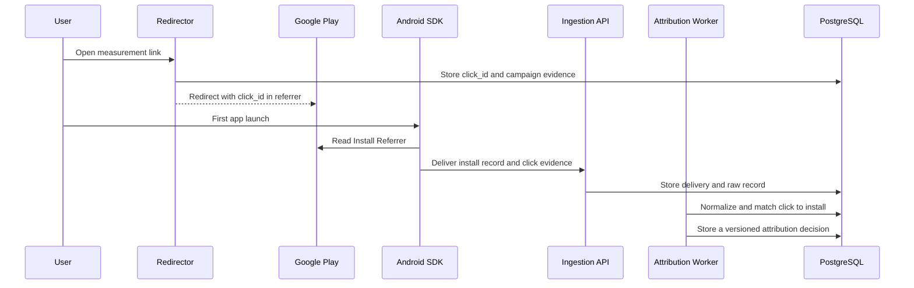

# Initial Architecture

## Approach

Start with a modular monolith and PostgreSQL. Do not add ClickHouse, Kafka, or service decomposition until measured load demonstrates the need.

Proposed stack:

- Server: TypeScript on Node.js
- Schemas: JSON Schema Draft 2020-12 with generated runtime types
- Database: PostgreSQL
- Android SDK: Kotlin
- Unity integration: C# API with an Android Kotlin bridge
- iOS SDK: Swift, Phase 2
- Dashboard: TypeScript web application, later in the MVP
- Local runtime: Docker Compose

## Cloudflare-first reference deployment

Cloudflare is the preferred future reference deployment, not a Cloudflare-only product requirement. Use Workers for redirector and API edge handling, Queues for asynchronous ingestion, R2 for protected raw evidence and versioned snapshots, Pages or Workers for the dashboard, and Secrets Store for deployment secrets. Use Cloudflare Containers only for future workloads that require a full Linux container rather than the Workers runtime. Keep the authoritative audit ledger on PostgreSQL initially, reached from Workers through Hyperdrive. D1 may hold configuration or small metadata, but must not become the authoritative audit ledger until contract and equivalence evidence prove it suitable. Preserve self-hostability through explicit storage, queue, and database ports; no public contract may depend on a Cloudflare-specific API.

## Android Phase 1 flow



## Components

### Redirector

- Accepts `GET /r/{slug}`
- Resolves an approved destination from the link configuration
- Generates and records a server-side `click_id`
- Adds an encoded referrer to the Google Play URL on Android
- Falls back to a safe configured destination without exposing internal errors

### Ingestion API

- Accepts `POST /v1/events/batch`
- Assigns the authoritative tenant and app from an authenticated SDK key or adapter configuration; client-supplied IDs are consistency checks only
- Validates payload size, event count, schema version, and client-clock skew: when client `occurred_at` is later than `received_at + 5 minutes`, retain it as evidence and mark `clock_skew_suspected`; it never controls an attribution window
- Stores delivery, raw record, and logical event as separate concepts
- Distinguishes successful receipt from successful normalization or attribution

Minimal delivery example:

```json
{
  "raw_record": {
    "contract_version": "0.1.0",
    "record_id": "record:example-install",
    "tenant_id": "tenant:example",
    "app_id": "app:example",
    "producer": "sdk-android",
    "producer_version": "0.1.0",
    "event_id": "event:example-install",
    "delivery_id": "delivery:example-install",
    "event_name": "install",
    "schema_version": "0.1.0",
    "payload_sha256": "0000000000000000000000000000000000000000000000000000000000000000",
    "occurred_at": "2026-08-11T00:00:00.000Z",
    "occurred_at_source": "device",
    "received_at": "2026-08-11T00:00:01.000Z",
    "payload_lifecycle_status": "available",
    "raw_payload_ref": "protected:example-install",
    "processing_purpose_id": "purpose:attribution",
    "consent_evaluation_policy_version": "consent-policy-0.1",
    "consent_decision_reason_code": "consent_not_required"
  },
  "payload": {
    "event_name": "install",
    "installation_id": "installation:example",
    "referrer_status": "none",
    "install_type": "first_install"
  }
}
```

The canonical schemas live in `schemas/`; this example is illustrative and validated against `schemas/raw-record.schema.json` and `schemas/events/install.schema.json`.

### Attribution Core

Implement attribution as a pure evaluator. Recalculation must fix the inputs and all relevant policy versions:

- Raw-record watermark
- Immutable input snapshot ID or ledger position
- Attribution rule bundle
- Metric definition
- Time zone and window boundaries
- FX policy and rounding
- Output schema version

Initial Android rule:

1. Extract a verifiable `click_id` from Install Referrer evidence.
2. Confirm that the click belongs to the same tenant and app.
3. Evaluate the seven-day half-open window with the redirector-recorded click time and the Google Play server `install_begin_at_server`; device `occurred_at` is evidence only and never decides the window.
4. Return `non_organic` with a deterministic method and reason when valid.
5. Otherwise return `organic` or `unattributed` with an explicit reason code.

### Reporting API

- Separate raw-record access from aggregate reporting
- Require an explicit time zone for every period query
- Include attribution method, rule version, input watermark, and data freshness
- Include an immutable input snapshot ID or ledger position so equal timestamps cannot select different record sets
- Expose late-arrival and recalculation state
- Never present aggregate privacy reports as installation-level records

## Data layers

Minimum logical entities:

- `tenants`
- `apps`
- `sdk_keys`
- `tracking_links`
- `clicks`
- `raw_records`
- `event_deliveries`
- `events`
- `corrections`
- `installations`
- `attributions`
- `fraud_decisions`
- `metric_runs`
- `privacy_requests`
- `audit_logs`

The layers have distinct responsibilities:

- `raw_records`: append-only received evidence and payload digest
- `event_deliveries`: retries, duplicate deliveries, and ID conflicts
- `events`: normalized logical events
- `corrections`: causal correction, retraction, and redaction records
- `attributions`: versioned and supersedable decisions
- `metric_runs`: aggregates with a fixed input watermark and policy versions

Do not compress independent concerns into one `data_quality_status`. Store ingestion, duplicate resolution, timeliness, record lifecycle, and attribution finality as separate axes.

## Attribution result minimum

- `attribution_id`
- `tenant_id`
- `app_id`
- `subject_scope`: `installation_level | aggregate`
- `subject_ref`
- `status`: `organic | non_organic | unattributed`
- `method`
- `model`
- `reason_code` and registry version
- Evidence references with access classifications
- Input cutoff and decision timestamps
- Rule bundle ID, version, and digest
- `finality`
- `supersedes_attribution_id`

Aggregate subjects must not contain an `installation_id`.

## Later phases

- Existing MMP raw-export adapters and shadow reconciliation
- Apple AdAttributionKit and SKAdNetwork postback receipt and verification
- Google announced the retirement of Attribution Reporting (Android) on 2025-10-17 and no longer accepts enrollment; this project does not adopt it.
- Server-to-server events
- Role-based access control
- Analytical storage when PostgreSQL is no longer sufficient
- Media cost adapters

Privacy-preserving aggregate reports remain a dedicated aggregate series and are never forcibly joined to an installation.
